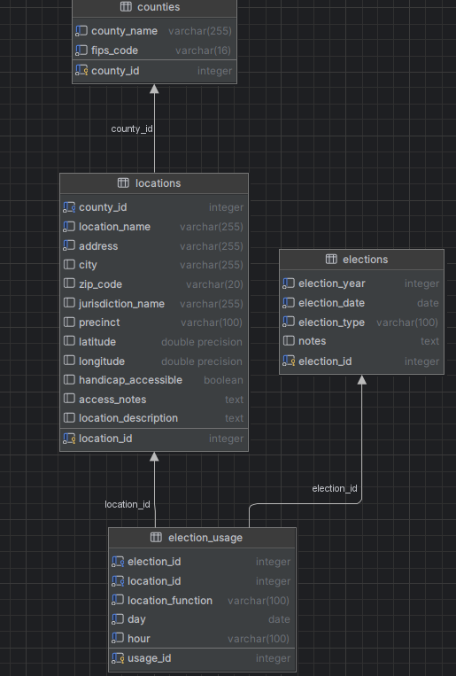

# Project Setup Guide

Follow the instructions below to understand how to locally setup and run the query interface!

---

## 1. Clone This Github Repository

1. Open VS Code  
2. Press **Ctrl + Shift + P**  
3. Type and select: **Git: Clone**  
4. Paste the repository URL (from the main page of this repository clicke code and copy the URL under the HTTPS section) and press Enter  
5. Choose a folder on your computer to save the project  
6. Click **Open** when prompted  

## 2. Create a Virtual Environment

This is neccessary so that you have the proper packages installed on your computer and are therefore able to run the code. 

Run:

```
python -m venv venv
```

Then activate it:

**On Windows (PowerShell):**

```
.\venv\Scripts\Activate
```

**On Mac/Linux:**

```
source venv/bin/activate
```

It will now say `(venv)` in your terminal in green

---

## 3. Install Required Packages

With the virtual environment activated, install dependencies:

```
pip install -r requirements.txt
```

---

## 4. Create a `.env` File

In the root of the project folder, the same level as the `README.md` file, create a new file named:

```
.env
```

Add the following variables:

```
ADMIN_DATABASE_URL=your_admin_database_url_here
QUERY_DATABASE_URL=your_query_database_url_here
```

Replace the values with the database connection strings sent in the confidential format.

---

## 5. Run the Application

Open a new terminal and input: 

```
streamlit run apps/admin_app.py
```

This will open the app in your web browser automatically and you will be able to upload new data to the database.

---

# Understanding The Upload Workflow 

## Database Schema For Reference


## 1. Download All Cleaned and Properly Formatted Files From the Jupyter Notebook Cleaning Tool

You should have a file for locations and election usage after the cleaning steps are complete.

## 2. Updating The Elections Table 
This table contains key information to identify each unique election that is present in the database. 

If these files contain information for an election that is already entered, omit this step; if not, continue reading. 

Follow these steps to add an election to the database:
- Login to NEON where the database is hosted 
- On the left hand side of the screen, click `Tables`
- Select the `elections` table
- Click the `Add record` button 
- Enter information for the year, date, and election_type, as these are the minimum requirements for a new record to be inputted into the `elections` table; the rest of the columns are optional
- Once you are done entering the data, click `Save Changes`

## 3. Upload The `Locations` CSV
- Return to the query app that is running locally on your computer and select `locations` as your target table 
- Upload the locations CSV you downloaded earlier from the Jupyter notebook into the uploader at the bottom of the screen
- If there is a validation error, review the bottom of the `README` file for more information
- Click `Upload To Database` and wait for confirmation that the data was successfully uploaded 
- Click the `X` button just below where it says `Browse Files` to reset the page

## 4. Upload the `Election Usage` CSV
- Select `election_usage` as your target table 
- Upload the election usage CSV you downloaded earlier from the Jupyter notebook into the uploader at the bottom of the screen
- If there is a validation error, review the bottom of the `README` file for more information
- Click `Upload To Database` and wait for confirmation that the data was successfully uploaded 
- Click the `X` button just below where it says `Browse Files` to reset the page

## Common Validation Errors

The uploader validates files before inserting them into the database. If an upload is not allowed, the app will show one or more validation errors and will not commit that file.

Common upload errors:

- `Missing required column`: The CSV does not include a column that the selected upload type requires. Check the "Expected CSV columns" table in the app.
- `Required value missing`: A required column exists, but one or more rows have a blank value in that column.
- `Unexpected column will be ignored`: The CSV includes a column the app does not recognize for that upload type. This is a warning, not always a blocker.
- `Invalid date value`: A date column has a value that cannot be parsed as a valid date. Use `YYYY-MM-DD` when possible. Blank optional date fields are allowed.
- `Invalid integer value`, `Invalid float value`, or `Invalid boolean value`: A value does not match the expected type for that column.
- `County does not exist in PostgreSQL`: A locations or election usage file references a county that is not already in the counties table.
- `Election does not exist in PostgreSQL`: An election usage file references an election type/date combination that is not already in the elections table.
- `Location does not exist in PostgreSQL`: An election usage file references a location name/address/county combination that is not already in the locations table.
- `Location is ambiguous`: More than one database location matches the identifying fields in the upload file, so the app cannot safely choose one.
- `Duplicate natural key found`: The upload file contains duplicate rows after lookup and normalization. For `election_usage`, this means duplicate `election_id`, `location_id`, `location_function`, `day`, and `hour` values. Blank `day` or `hour` values can still collide with other blank values.

If an upload fails after validation, the transaction is rolled back, so none of the rows from that file will be uploaded to the database. If this happens simply address the error in the data and try uploading again. 
